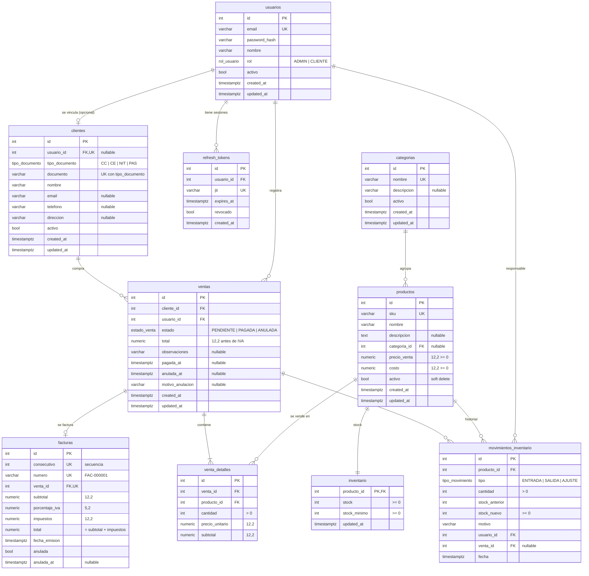

# Diagrama entidad-relación

Propuesta inicial generada desde los modelos de SQLAlchemy (migraciones `0001`–`0004`).
GitHub y VS Code (con la extensión de Mermaid) lo dibujan automáticamente.

```mermaid
erDiagram
    usuarios ||--o| clientes : "se vincula (opcional)"
    usuarios ||--o{ refresh_tokens : "tiene sesiones"
    usuarios ||--o{ ventas : "registra"
    usuarios ||--o{ movimientos_inventario : "responsable"
    categorias ||--o{ productos : "agrupa"
    productos ||--|| inventario : "stock"
    productos ||--o{ movimientos_inventario : "historial"
    productos ||--o{ venta_detalles : "se vende en"
    clientes ||--o{ ventas : "compra"
    ventas ||--|{ venta_detalles : "contiene"
    ventas ||--o| facturas : "se factura"
    ventas ||--o{ movimientos_inventario : "origina"

    usuarios {
        int id PK
        varchar email UK
        varchar password_hash
        varchar nombre
        rol_usuario rol "ADMIN | CLIENTE"
        bool activo
        timestamptz created_at
        timestamptz updated_at
    }
    refresh_tokens {
        int id PK
        int usuario_id FK
        varchar jti UK
        timestamptz expires_at
        bool revocado
        timestamptz created_at
    }
    clientes {
        int id PK
        int usuario_id FK,UK "nullable"
        tipo_documento tipo_documento "CC | CE | NIT | PAS"
        varchar documento "UK con tipo_documento"
        varchar nombre
        varchar email "nullable"
        varchar telefono "nullable"
        varchar direccion "nullable"
        bool activo
        timestamptz created_at
        timestamptz updated_at
    }
    categorias {
        int id PK
        varchar nombre UK
        varchar descripcion "nullable"
        bool activo
        timestamptz created_at
        timestamptz updated_at
    }
    productos {
        int id PK
        varchar sku UK
        varchar nombre
        text descripcion "nullable"
        int categoria_id FK "nullable"
        numeric precio_venta "12,2 >= 0"
        numeric costo "12,2 >= 0"
        bool activo "soft delete"
        timestamptz created_at
        timestamptz updated_at
    }
    inventario {
        int producto_id PK,FK
        int stock ">= 0"
        int stock_minimo ">= 0"
        timestamptz updated_at
    }
    movimientos_inventario {
        int id PK
        int producto_id FK
        tipo_movimiento tipo "ENTRADA | SALIDA | AJUSTE"
        int cantidad "> 0"
        int stock_anterior
        int stock_nuevo ">= 0"
        varchar motivo
        int usuario_id FK
        int venta_id FK "nullable"
        timestamptz fecha
    }
    ventas {
        int id PK
        int cliente_id FK
        int usuario_id FK
        estado_venta estado "PENDIENTE | PAGADA | ANULADA"
        numeric total "12,2 antes de IVA"
        varchar observaciones "nullable"
        timestamptz pagada_at "nullable"
        timestamptz anulada_at "nullable"
        varchar motivo_anulacion "nullable"
        timestamptz created_at
        timestamptz updated_at
    }
    venta_detalles {
        int id PK
        int venta_id FK
        int producto_id FK
        int cantidad "> 0"
        numeric precio_unitario "12,2"
        numeric subtotal "12,2"
    }
    facturas {
        int id PK
        int consecutivo UK "secuencia"
        varchar numero UK "FAC-000001"
        int venta_id FK,UK
        numeric subtotal "12,2"
        numeric porcentaje_iva "5,2"
        numeric impuestos "12,2"
        numeric total "= subtotal + impuestos"
        timestamptz fecha_emision
        bool anulada
        timestamptz anulada_at "nullable"
    }
```
